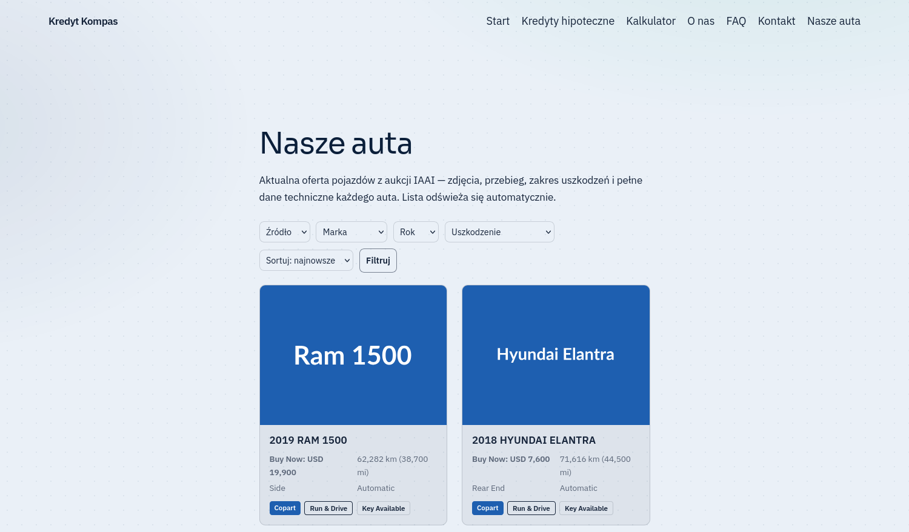

<!-- SPDX-License-Identifier: GPL-2.0-or-later -->
<div align="center">

# Importery aukcji do WordPressa

**Aktualna oferta z aukcji na stronie dealera — bez ręcznego wprowadzania
i bez zajmowania miejsca na hostingu.** Scraper w Pythonie na VPS utrzymuje
własną bazę MySQL, wtyczka WordPress czyta ją **tylko do odczytu** i renderuje
katalog z filtrami. Zdjęcia są hotlinkowane, więc dysk klienta zajmuje **0 MB**
niezależnie od wielkości oferty.

[▶ Uruchom demo w przeglądarce](https://playground.wordpress.net/?blueprint-url=https://raw.githubusercontent.com/krzysiek2115op/iaai-importer-demo/main/blueprint.json) ·
[Dziennik zmian](CHANGELOG.md) ·
[Współpraca](CONTRIBUTING.md) ·
[Wydania](https://github.com/krzysiek2115op/copart-iaai-importer/releases) ·
[Licencja GPL-2.0+](LICENSE) ·
[English](README.en.md)

<br>

[](https://playground.wordpress.net/?blueprint-url=https://raw.githubusercontent.com/krzysiek2115op/iaai-importer-demo/main/blueprint.json)

*Demo stawia WordPressa w Twojej przeglądarce z wgraną wtyczką i gotową
podstroną katalogu. Nic nie trzeba instalować ani konfigurować.*

<sub>**Kolorowe kafle zamiast zdjęć to właściwość dema, nie produktu** — demo nie
hotlinkuje prawdziwych zdjęć z aukcji. Na wdrożeniu w tym miejscu są zdjęcia
ze źródła i to jest sedno rozwiązania.</sub>


</div>

---

<details>
<summary><b>Spis treści</b></summary>

- [Stan projektu](#stan-projektu)
- [Dwie wtyczki, jedna architektura](#dwie-wtyczki-jedna-architektura)
- [Jak to działa (obie tak samo)](#jak-to-działa-obie-tak-samo)
- [Struktura podprojektu](#struktura-podprojektu-identyczna-w-obu)
- [Szybki start](#szybki-start)
- [Licencja](#licencja)

</details>

## Stan projektu

| | |
|---|---|
| **Wersje wtyczek** | `iaai-importer` **0.30.6** · `motocykle-poleasingowe` **0.12.6** |
| **Etap** | Obie wtyczki wdrożone i działające. Dokumentacja dla klienta gotowa |
| **Rozmiar** | **7 958 linii Pythona** (47 plików) + **3 634 linie PHP** (21 plików) |
| **Historia** | **134 commity** na `main` · **126 tagów** · **4 wydania** |
| **Dokumentacja dla klienta** | **23 pliki PDF** — instrukcje krok po kroku dla osoby nietechnicznej |
| **Demo** | [WordPress Playground](https://playground.wordpress.net/?blueprint-url=https://raw.githubusercontent.com/krzysiek2115op/iaai-importer-demo/main/blueprint.json) — osobne repo [`iaai-importer-demo`](https://github.com/krzysiek2115op/iaai-importer-demo) |
| **Licencja** | GPL-2.0-or-later ([LICENSE](LICENSE)) |

<sub>Liczby zmierzone: `git rev-list --count main`, `git ls-remote --tags origin`,
`gh api --paginate .../releases`, `find . -name '*.py' \| xargs cat \| wc -l`.</sub>

## Dwie wtyczki, jedna architektura

Monorepo z **dwiema niezależnymi wtyczkami WordPress** zbudowanymi na tym samym
wzorcu. Są **kompatybilne obok siebie** na jednej stronie: osobne bazy, brak
kolizji, każda dziedziczy wygląd aktywnego motywu.

| Podprojekt | Co robi | Źródło danych | Wersja |
|---|---|---|---|
| [`auta-iaai/`](auta-iaai/) | Podstrona **„Nasze auta"** — samochody z aukcji | **IAAI + Copart** (dwa źródła, kolumna `source`) | 0.30.6 |
| [`motocykle-poleasingowe/`](motocykle-poleasingowe/) | Podstrona **„Nasze motory"** — motocykle | **poleasingowe.pl** | 0.12.6 |

## Jak to działa (obie tak samo)

```
[ scraper Python na VPS ]  --(cron/systemd)-->  [ baza MySQL ]  <--(read-only)--  [ wtyczka WordPress ]
      pobiera ofertę,                              dane + zdjęcia                     pokazuje na stronie,
      normalizuje, audytuje                                                          SEO, filtry, cache
```

- **Wtyczka (PHP)** to część na WordPressie: tworzy podstronę, czyta bazę i renderuje ofertę
  (SEO/Schema.org, filtry, paginacja, cache). Sama wtyczka nie pobiera danych.
- **Scraper (Python)** działa na **serwerze VPS** (cron albo systemd timer) — to on „wybudza"
  pobieranie: crawl → normalizacja → deduplikacja → audyt → zapis do bazy. WP‑cron tego nie robi
  (nie uruchomi Pythona/Playwrighta).
- **Zdjęcia** są **hotlinkowane** (0 miejsca na dysku klienta).

## Struktura podprojektu (identyczna w obu)

```
<podprojekt>/
  wp-plugin/<wtyczka>/   # wtyczka WordPress (PHP) — TO wgrywasz do WP
  scraper/               # program zbierający (Python) — na VPS
  deploy/                # instalacja + automatyzacja (systemd/cron) + .env.example
  db/                    # schema.sql (osobna baza ofert)
  docs/                  # dokumentacja, w tym docs/klient/ (instrukcje krok po kroku, PDF)
  README.md
```

## Szybki start

1. **WordPress:** spakuj katalog `wp-plugin/<wtyczka>/` do ZIP i wgraj przez *Wtyczki → Dodaj nową
   → Wyślij wtyczkę*, włącz. Podstrona utworzy się sama i wepnie w menu.
2. **Baza:** załóż osobną bazę z `db/schema.sql`, dane dostępu wpisz do `wp-config.php`
   (stałe `POLEA_DB_*` / `IAAI_DB_*`).
3. **Automatyzacja:** uruchom scraper na VPS wg `deploy/README.md` i `docs/klient/`.

Instrukcje krok po kroku (dla osoby nietechnicznej, PDF) są w `docs/klient/` każdego podprojektu.

## Współpraca

Workflow, wersjonowanie (dwie osobne osie wersji!) i konwencja commitów:
[`CONTRIBUTING.md`](CONTRIBUTING.md). Historia wydań: [`CHANGELOG.md`](CHANGELOG.md)
— zbudowana z anotowanych tagów, wszystkie 126 mają opis.

## Licencja

GPL-2.0-or-later — patrz [LICENSE](LICENSE). Zgodna z licencją samego WordPressa,
więc wtyczki można rozpowszechniać razem z nim bez dodatkowych warunków.
