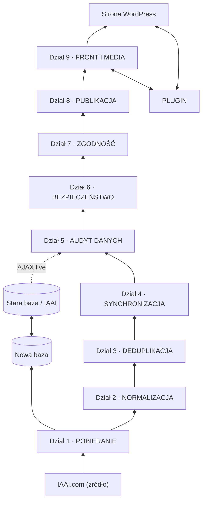

# Schemat wieloagentowy (rozwodniony: 1 agent : 1 krytyk)

Zasada nadrzędna: **każdy agent ma dokładnie jednego krytyka; nigdy kilku agentów
na jednego krytyka.** Poniżej diagram v1 z rysunku, rozwinięty tak, by zasada była
spełniona.

## Pipeline (przepływ danych)

## Pary agent → krytyk (1:1) per dział

Legenda: 🔵 **Agent** (wykonuje) · 🔴 **Krytyk** (sprawdza wynik tego jednego agenta).

### Dział 1 · POBIERANIE — `dok: dostep.md, listingi.md, szczegoly.md, zdjecia.md`
| 🔵 Agent | Zadanie | 🔴 Krytyk | Co sprawdza |
|---|---|---|---|
| listingi | przechodzi wyszukiwarkę IAAI (full + live), zbiera ID lotów | kompletność-listy | brak luk w paginacji, żaden lot nie wypadł |
| szczegóły | pobiera pełne pola pojazdu dla lotu | kompletność-pól | czy kluczowe pola (VIN, make/model, odometer…) są |
| zdjęcia | pobiera listę + obrazy z `vis.iaai.com` | kompletność-zdjęć | zgodność liczby zdjęć, brak uszkodzonych |

### Dział 2 · NORMALIZACJA — `dok: normalizacja.md`
| 🔵 Agent | Zadanie | 🔴 Krytyk | Co sprawdza |
|---|---|---|---|
| VIN | walidacja/normalizacja VIN (17 znaków, checksum) | poprawność-VIN | czy VIN poprawny i nie zniekształcony |
| jednostki | ujednolicenie jednostek (mi/km, daty, ceny) | jakość-jednostek | spójność jednostek i formatów |

### Dział 3 · DEDUPLIKACJA — `dok: deduplikacja.md`
| 🔵 Agent | Zadanie | 🔴 Krytyk | Co sprawdza |
|---|---|---|---|
| match | wykrywa duplikaty (salvage_id, VIN) | fałszywe-trafienia | czy dopasowanie to nie błędny merge różnych aut |

### Dział 4 · SYNCHRONIZACJA — `dok: sync.md`
| 🔵 Agent | Zadanie | 🔴 Krytyk | Co sprawdza |
|---|---|---|---|
| diff | porównuje rekord ze stanem w bazie (raw_hash) | spójność-diff | czy wykryte zmiany są prawdziwe, nie szum |
| json | buduje/aktualizuje wpis w nowej bazie | poprawność-json | poprawność zapisu/struktury danych |

### Dział 5 · AUDYT DANYCH — `dok: audyt.md`
| 🔵 Agent | Zadanie | 🔴 Krytyk | Co sprawdza |
|---|---|---|---|
| walidacja | sprawdza dane względem reguł (typy, zakresy) | poprawność-audytu | czy walidacja nie przepuszcza błędnych rekordów |

### Dział 6 · BEZPIECZEŃSTWO — `dok: bezpieczenstwo.md`
| 🔵 Agent | Zadanie | 🔴 Krytyk | Co sprawdza |
|---|---|---|---|
| sanityzacja | czyści/escapuje dane przed zapisem/wyświetleniem | podatności-sanityzacji | czy nie przeszło XSS/SQLi |
| nonce | obsługa nonce/uprawnień w akcjach WP | poprawność-nonce | czy nonce/uprawnienia są wymuszone |

### Dział 7 · ZGODNOŚĆ — `dok: zgodnosc.md`
| 🔵 Agent | Zadanie | 🔴 Krytyk | Co sprawdza |
|---|---|---|---|
| zgody | egzekwuje reguły (rate-limit, robots, ToS) | blokady | czy nie łamiemy ograniczeń źródła |

### Dział 8 · PUBLIKACJA — `dok: publikacja.md`
| 🔵 Agent | Zadanie | 🔴 Krytyk | Co sprawdza |
|---|---|---|---|
| CPT | tworzy/aktualizuje wpis CPT „Pojazd" | poprawność-CPT | czy wpis powstał i wiąże się z rekordem |
| meta | mapuje pola → meta/taksonomie WP | poprawność-meta | czy meta/filtry mają komplet danych |

### Dział 9 · FRONT I MEDIA — `dok: front.md, media.md`
| 🔵 Agent | Zadanie | 🔴 Krytyk | Co sprawdza |
|---|---|---|---|
| front | renderuje szablony (lista, szczegóły, filtry) | render-front | czy strona wyświetla dane poprawnie |
| media | import/optymalizacja zdjęć (galeria) | render-media | czy zdjęcia ładują się i są spójne |

## Podsumowanie liczbowe
**16 agentów → 16 krytyków** (1:1). Działy 3, 5, 7 mają po jednym agencie (już 1:1);
reszta rozwodniona, by każdy agent miał własnego krytyka.

## Moje uwagi doradcze (granularność)
- **Pobieranie (3 agenty)** — słusznie rozdzielone: listingi/szczegóły/zdjęcia to różne
  zadania i różne kryteria „kompletności". Zostawiam 3.
- **Normalizacja (2)** — VIN ma osobne reguły (checksum) niż jednostki; podział OK.
- **Bezpieczeństwo (2)** — sanityzacja (XSS/SQLi) i nonce (uprawnienia) to dwa różne
  światy; podział OK.
- **Publikacja (2)** i **front+media (2)** — realnie odrębne odpowiedzialności; podział OK.
- **Deduplikacja / audyt / zgodność (po 1)** — NIE dzieliłbym; to spójne, pojedyncze
  zadania, dokładanie agentów tylko skomplikuje bez zysku.
- ⚠️ Jedyny kandydat do ewentualnego dalszego rozwodnienia w przyszłości: agent
  **szczegóły** (dużo pól) — gdyby okazało się, że gubi pola, można rozbić na
  „dane techniczne" vs „dane aukcji". Na razie zostawiam jako jeden.
