# 🗺️ Jak działa system — diagram

Prosty obraz tego, jak auta trafiają z aukcji IAAI na Twoją stronę. Wszystko dzieje się
**automatycznie, całą dobę** — Ty nic nie klikasz na co dzień.

---

## Obieg w skrócie (diagram)

```mermaid
flowchart TB
    IAAI["🌐 IAAI.com&#10;aukcje aut — źródło danych"]

    subgraph VPS["🖥️ Twój serwer (VPS) — pracuje sam 24/7"]
        SCR["🤖 Program zbierający&#10;pobiera auta + zdjęcia"]
        DB[("🗄️ Baza danych&#10;magazyn aut")]
    end

    subgraph WP["🌍 Twoja strona WordPress"]
        PLUG["🔌 Wtyczka IAAI Importer"]
        SITE["📄 Strona z autami"]
    end

    VISITOR["👤 Klienci / odwiedzający"]

    IAAI -->|"co 15 min: sprawdza nowe auta&#10;raz dziennie: pełna synchronizacja"| SCR
    SCR -->|"zapisuje dane + zdjęcia"| DB
    DB --> PLUG
    PLUG -->|"publikuje auta"| SITE
    SITE --> VISITOR
```



> Jeśli powyższy obrazek się nie wyświetla (np. w mailu) — niżej jest ta sama treść jako rysunek tekstowy.

---

## Ta sama treść — wersja tekstowa (widoczna wszędzie)

```
        🌐  IAAI.com  (aukcje aut — źródło)
              │
              │   co 15 min  → sprawdza nowe auta
              │   raz dziennie → pełna synchronizacja (sprząta, co zniknęło)
              ▼
 ┌─────────────────────────────────────────────────────┐
 │  🖥️  TWÓJ SERWER (VPS) — pracuje sam, całą dobę       │
 │                                                       │
 │   🤖 Program zbierający  ──zapisuje──►  🗄️ Baza danych │
 │   (pobiera auta + zdjęcia)              (magazyn aut)  │
 └─────────────────────────────────────────────┬─────────┘
                                                │
                                                ▼
 ┌─────────────────────────────────────────────────────┐
 │  🌍  TWOJA STRONA WORDPRESS                            │
 │                                                       │
 │   🔌 Wtyczka IAAI Importer ──publikuje──► 📄 Strona   │
 │                                            z autami    │
 └─────────────────────────────────────────────┬─────────┘
                                                │
                                                ▼
                                    👤  Klienci / odwiedzający
                                        (widzą auta na stronie)
```

---

## Co dzieje się „w środku" (4 kroki)

```
 [1] POBIERA      →  [2] PORZĄDKUJE     →  [3] ZAPISUJE      →  [4] POKAZUJE
 auta + zdjęcia      mile → kilometry      do bazy danych       na stronie jako
 z IAAI              marka/model z VIN     (nowe dodaje,         ogłoszenia;
                     odrzuca błędne        zmienione poprawia,   sprzedane/zdjęte
                     wpisy                 znikłe oznacza)       znikają ze strony
```

## Legenda (proste tłumaczenia)
- **IAAI.com** — serwis z aukcjami aut (skąd biorą się pojazdy).
- **VPS** — Twój serwer, na którym całą dobę pracuje program zbierający.
- **Program zbierający** — „robot", który czyta auta z IAAI i wkłada do bazy.
- **Baza danych** — magazyn, w którym trzymane są auta i ich dane.
- **Wtyczka** — dodatek do WordPress, który pokazuje auta na stronie.
- **Strona z autami** — to, co widzą Twoi klienci.

---
*Pełny opis i instrukcje krok po kroku: [00-START-TUTAJ.md](00-START-TUTAJ.md).*
